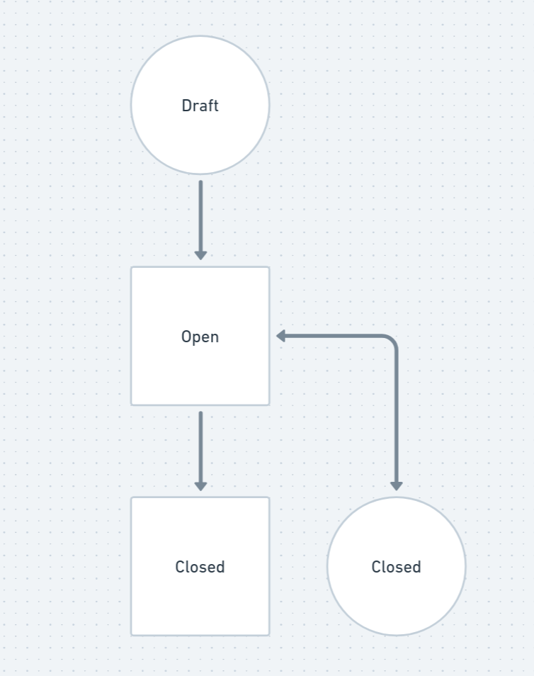
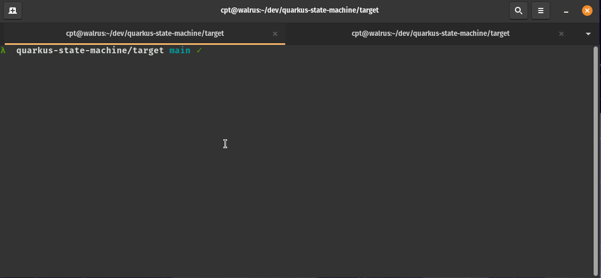
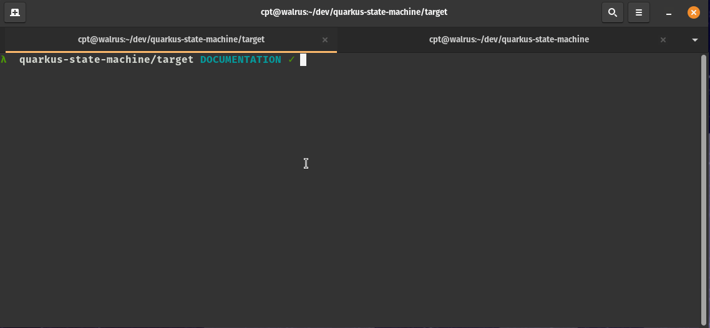

[](https://codecov.io/gh/josh-mchugh/quarkus-state-machine)

# Simple Statemachine With Quarkus

This project is an experiment for designing a simple statemachine. I have used more complex statemachines such as [Spring Statemachine](https://spring.io/projects/spring-statemachine). I wanted to make a simple Java based statemachine pattern without the use of a framework. I used Quarkus as a RESTful API framework for demostration and practice purposes.

I based it off an article from Baeldung: [https://www.baeldung.com/java-enum-simple-state-machine](https://www.baeldung.com/java-enum-simple-state-machine)

Instead of using the LeaveRequestState for manging approval states of somones leave. I decided to make a small statemachine around Git pull requests.

## State Diagram

There are a total of 4 states within this state machine.

1. DRAFT
2. OPEN
3. MERGED
4. CLOSED

DRAFT is the starting state.
MERGED and closed are end states.

DRAFT can transition to OPEN
OPEN can transition to MERGED or CLOSED
CLOSE can transition to OPEN



## Demostration

An example of a successful flow of creating a pull request and transitioning it to the merge state



An example of an unsuccessful flow is creating a pull request and attempting to transition between states in an incorrect order



## Running the application in dev mode

You can run your application in dev mode that enables live coding using:
```shell script
./mvnw compile quarkus:dev
```
